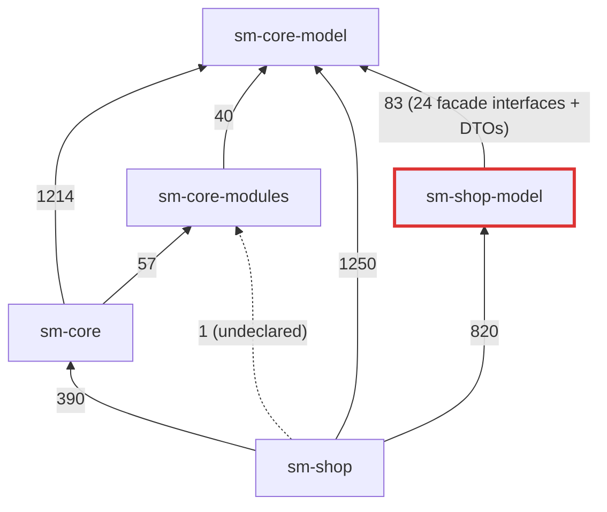
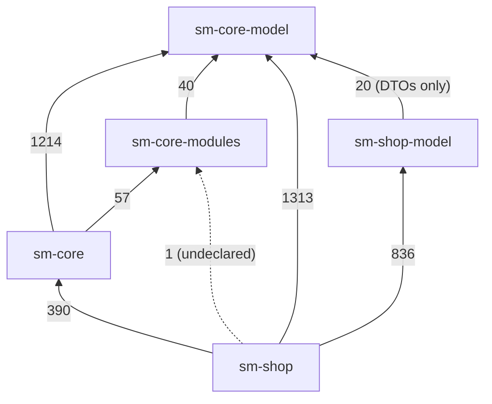
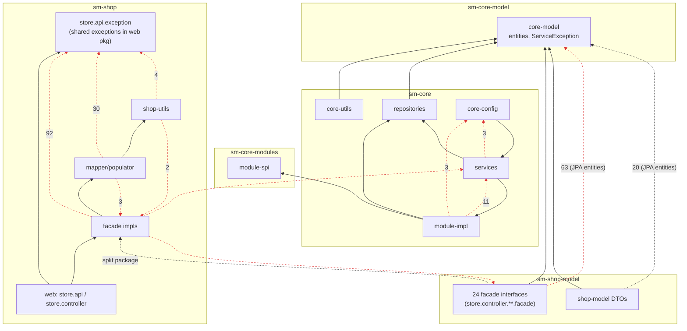

# Module dependency audit

Audit of the Shopizer build (`sm-core-model`, `sm-core-modules`, `sm-core`, `sm-shop-model`, `sm-shop`) for dependency cycles and layering violations. Every finding cites `file:line` of the offending import. The numbers come from `tools/depgraph/depgraph.py`, which you can re-run at any time:

```
python3 tools/depgraph/depgraph.py            # full text report with file:line for every edge
python3 tools/depgraph/depgraph.py --mermaid  # module graph as Mermaid
```

## Method

* The tool reads every `src/main/java` file in the five modules (1,167 classes) and resolves each `import com.salesmanager.…` line (including static and wildcard imports) and each inline fully-qualified `com.salesmanager.…` reference to the class that declares it. That gives 5,503 internal references, each with its source `file:line`.
* **Module graph:** the references are grouped by module and compared with the `<dependency>` entries in each `pom.xml`.
* **Cycles:** Tarjan strongly-connected components (SCC) over the Java *package* graph, where package A → package B if any class in A references a class in B.
* **Layering:** each package is assigned to a layer (table below). A reference from a lower layer to a higher one is a violation.

### Assumptions

1. **Intended layering.** The repo has no written architecture, so the layer order was inferred from the Maven graph and the package names. From lowest to highest:

   | Rank | Layer | Packages |
   |---|---|---|
   | 0 | core-model | `core.model.*`, `core.constants`, `core.utils`, `core.business.exception` (the classes that live in `sm-core-model`) |
   | 1 | module-spi / shop-model | `core.modules.*` (`sm-core-modules`), `shop.model.*`, `shop.validation`, `shop.util` (`sm-shop-model`) |
   | 2 | core-utils | `core.business.utils`, `core.business.constants` |
   | 3 | repositories | `core.business.repositories` |
   | 4 | module-impl | `core.business.modules` (shipping, payment, CMS, order-total integrations) |
   | 5 | services | `core.business.services` |
   | 6 | core-config | `core.business.configuration` (Spring wiring, Drools, events) |
   | 7 | shop-exception / shop-constants | `shop.store.api.exception`, `shop.constants` |
   | 8 | shop-utils | `shop.utils` |
   | 9 | mapper/populator | `shop.mapper`, `shop.populator` |
   | 10 | facade | `shop.store.facade.*` and every `shop.store.controller.**.facade` package (plus `…controller.optin`, `…controller.system` and `…controller.configurations`, which contain only facades) |
   | 11 | web | `shop.store.api.*` and the remaining `shop.store.controller.*` |
   | 12 | shop-config | `shop.application.*` |

   Layer 7 is where the shared REST exceptions *should* sit: facades, mappers and utils all throw them. They are physically in the web package `shop.store.api.exception`, so the tool reports a reference to them from anything below the web layer as "lower layer → web package".
2. **The `sm-shop-model` module is meant to be the API DTO contract** (its pom describes it as the "shop model"). So a reference from it to a JPA entity in `sm-core-model` counts as a layering violation. Its declared dependency on `sm-core-model` is legal Maven, but it couples the published DTO jar to the persistence model.
3. **Cycles inside the JPA entity graph are not counted as defects.** The three SCCs in `core.model.*` and the large one in `shop.model.*` come from bidirectional `@OneToMany`/`@ManyToOne` mappings and DTOs nesting each other. They are listed for completeness only.
4. **Only `src/main` is analysed.** Test sources are excluded.
5. **Controllers calling services directly are not counted as violations.** In `shop.store.api.*` there are 39 such references in 19 files; skipping the facade is an existing, accepted pattern in this codebase.

## Module graph

Maven itself forbids module cycles, and the observed graph is a DAG. The findings at module level are the undeclared edge (dotted line) and the size of the `sm-shop-model → sm-core-model` edge.

### Before



### After this change



Edge labels count the import references from the source module to the target module.

## Layer graph and violations

Solid arrows show allowed (downward) dependencies. Red dashed arrows show upward references that the tool found on the default branch, labelled with reference counts.



## Package cycles

The tool found 10 SCCs on the default branch. Four of them are the entity/DTO clusters covered by assumption 3 (7 + 14 + 6 packages in `core.model`, 17 in `shop.model`). The other six are real design cycles:

### C1. `core.business.configuration` ↔ `core.business.modules.order.total` (Sev 3: tech debt)
- `sm-core/src/main/java/com/salesmanager/core/business/modules/order/total/PromoCodeCalculatorModule.java:13` → `core.business.configuration.DroolsBeanFactory`
- `sm-core/src/main/java/com/salesmanager/core/business/configuration/ProcessorsConfiguration.java:11` → `core.business.modules.order.total.PromoCodeCalculatorModule`

A module implementation reaches up into the Spring configuration package to get the Drools factory. `DroolsBeanFactory` should move to a package below the modules, for example `core.business.modules.rules`.

### C2. Catalog services ↔ `core.business.configuration.events.products` (Sev 3)
- `sm-core/src/main/java/com/salesmanager/core/business/services/catalog/product/image/ProductImageServiceImpl.java:17` → `configuration.events.products.DeleteProductImageEvent`
- `sm-core/src/main/java/com/salesmanager/core/business/services/catalog/product/image/ProductImageServiceImpl.java:18` → `configuration.events.products.SaveProductImageEvent`
- `sm-core/src/main/java/com/salesmanager/core/business/configuration/events/products/PublishProductAspect.java:55`, `:70` → `services.catalog.product.ProductService`
- `sm-core/src/main/java/com/salesmanager/core/business/configuration/events/products/PublishProductAspect.java:101`, `:114` → `services.catalog.product.image.ProductImageService`
- `sm-core/src/main/java/com/salesmanager/core/business/services/catalog/product/ProductServiceImpl.java:26`, `:31`, `:34` → `CategoryService`, `ProductImageService`, `ProductReviewService`
- `sm-core/src/main/java/com/salesmanager/core/business/services/catalog/category/CategoryServiceImpl.java:23` → `ProductService`
- `sm-core/src/main/java/com/salesmanager/core/business/services/catalog/product/review/ProductReviewServiceImpl.java:13` → `ProductService`

The event classes are published by services but live in the configuration package. They belong in a lower package such as `core.business.services.catalog.product.events`. There is also a bidirectional service pair, product ↔ category/review.

### C3. `services.order` ↔ `services.payments` ↔ `services.shoppingcart` (Sev 3)
- `sm-core/src/main/java/com/salesmanager/core/business/services/order/OrderServiceImpl.java:36`, `:37` → `PaymentService`, `TransactionService`
- `sm-core/src/main/java/com/salesmanager/core/business/services/order/OrderServiceImpl.java:39` → `ShoppingCartService`
- `sm-core/src/main/java/com/salesmanager/core/business/services/payments/PaymentServiceImpl.java:24` → `OrderService`
- `sm-core/src/main/java/com/salesmanager/core/business/services/shoppingcart/ShoppingCartCalculationServiceImpl.java:14` → `OrderService`
- `sm-core/src/main/java/com/salesmanager/core/business/services/shoppingcart/ShoppingCartCalculationServiceImpl.java:15` → **`OrderServiceImpl`**. This imports the concrete implementation rather than the interface, and is the only cross-package `*ServiceImpl` import in `services`.

### C4. `modules.cms.content` ↔ `modules.cms.content.infinispan` (Sev 3)
- `sm-core/src/main/java/com/salesmanager/core/business/modules/cms/content/StaticContentFileManagerImpl.java:10` → `infinispan.CmsStaticContentFileManagerImpl` (concrete class)
- `sm-core/src/main/java/com/salesmanager/core/business/modules/cms/content/infinispan/CmsStaticContentFileManagerImpl.java:25` → `cms.content.ContentAssetsManager`

### C5. `shop.utils` ↔ `shop.store.controller.store.facade` ↔ `shop.populator.store` (Sev 3)
- `sm-shop/src/main/java/com/salesmanager/shop/utils/LanguageUtils.java:27` → `store.controller.store.facade.StoreFacade`. This is the upward edge that closes the cycle.
- `sm-shop/src/main/java/com/salesmanager/shop/store/controller/store/facade/StoreFacadeImpl.java:43`, `:44` → `populator.store.PersistableMerchantStorePopulator`, `ReadableMerchantStorePopulator`
- `sm-shop/src/main/java/com/salesmanager/shop/store/controller/store/facade/StoreFacadeImpl.java:48`, `:49` → `utils.ImageFilePath`, `utils.LanguageUtils`
- `sm-shop/src/main/java/com/salesmanager/shop/populator/store/PersistableMerchantStorePopulator.java:29` → `utils.DateUtil`
- `sm-shop/src/main/java/com/salesmanager/shop/populator/store/ReadableMerchantStorePopulator.java:33`, `:34` → `utils.DateUtil`, `utils.ImageFilePath`

### C6. `shop.model.order` ↔ `shop.model.order.v0` (Sev 3)
- `sm-shop-model/src/main/java/com/salesmanager/shop/model/order/OrderEntity.java:12` → `v0.Order`
- `sm-shop-model/src/main/java/com/salesmanager/shop/model/order/ReadableShopOrder.java:8` → `v0.ReadableOrder`
- `sm-shop-model/src/main/java/com/salesmanager/shop/model/order/ShopOrder.java:11` → `v0.PersistableOrder`
- `sm-shop-model/src/main/java/com/salesmanager/shop/model/order/v0/PersistableOrder.java:7`, `:8` → `order.OrderEntity`, `order.PersistableOrderProduct`
- `sm-shop-model/src/main/java/com/salesmanager/shop/model/order/v0/ReadableOrder.java:8`, `:9` → `order.OrderEntity`, `order.ReadableOrderProduct`

The generic base package depends on a version-specific subpackage. The shared types should stay in `order` and `v0` should depend only downward.

## Layering violations

Line numbers refer to the default branch `3.2.7`. Moved files are cited at their original path.

### L1. Facade interfaces live in the DTO module, which makes it depend on JPA entities and splits a package (**worst offender, fixed in this PR**)

`sm-shop-model` contained 24 service-layer facade interfaces under `com.salesmanager.shop.store.controller.**`. Their only implementations and callers are in `sm-shop`. These interfaces caused:

* **63 of the 83** `sm-shop-model → sm-core-model` references. Their method signatures take `MerchantStore`, `Language`, `Product`, `Customer`, `Order` and other JPA entities.
* **The only split package in the build.** `com.salesmanager.shop.store.controller.shipping.facade` was defined in both `sm-shop-model` (`ShippingFacade`, `ShippingModuleConfigurationFacade`) and `sm-shop` (`ShippingFacadeImpl`). A split package breaks JPMS modularisation and sealed jars, and makes the source hard to navigate.
* A published "model" artifact that ships service contracts, so web-layer package names (`store.controller`) leaked into the DTO jar.

<details><summary>All 63 facade → JPA-entity references (click to expand)</summary>

- `sm-shop-model/src/main/java/com/salesmanager/shop/store/controller/catalog/facade/CatalogFacade.java:3` → `core.model.catalog.catalog.Catalog`
- `sm-shop-model/src/main/java/com/salesmanager/shop/store/controller/catalog/facade/CatalogFacade.java:4` → `core.model.merchant.MerchantStore`
- `sm-shop-model/src/main/java/com/salesmanager/shop/store/controller/catalog/facade/CatalogFacade.java:5` → `core.model.reference.language.Language`
- `sm-shop-model/src/main/java/com/salesmanager/shop/store/controller/order/facade/v1/OrderFacade.java:3` → `core.model.customer.Customer`
- `sm-shop-model/src/main/java/com/salesmanager/shop/store/controller/order/facade/v1/OrderFacade.java:4` → `core.model.merchant.MerchantStore`
- `sm-shop-model/src/main/java/com/salesmanager/shop/store/controller/order/facade/v1/OrderFacade.java:5` → `core.model.order.Order`
- `sm-shop-model/src/main/java/com/salesmanager/shop/store/controller/order/facade/v1/OrderFacade.java:6` → `core.model.reference.language.Language`
- `sm-shop-model/src/main/java/com/salesmanager/shop/store/controller/user/facade/UserFacade.java:5` → `core.model.common.Criteria`
- `sm-shop-model/src/main/java/com/salesmanager/shop/store/controller/user/facade/UserFacade.java:6` → `core.model.merchant.MerchantStore`
- `sm-shop-model/src/main/java/com/salesmanager/shop/store/controller/user/facade/UserFacade.java:7` → `core.model.reference.language.Language`
- `sm-shop-model/src/main/java/com/salesmanager/shop/store/controller/user/facade/UserFacade.java:8` → `core.model.user.UserCriteria`
- `sm-shop-model/src/main/java/com/salesmanager/shop/store/controller/shipping/facade/ShippingFacade.java:5` → `core.model.merchant.MerchantStore`
- `sm-shop-model/src/main/java/com/salesmanager/shop/store/controller/shipping/facade/ShippingFacade.java:6` → `core.model.reference.language.Language`
- `sm-shop-model/src/main/java/com/salesmanager/shop/store/controller/shipping/facade/ShippingFacade.java:7` → `core.model.shipping.PackageDetails`
- `sm-shop-model/src/main/java/com/salesmanager/shop/store/controller/manufacturer/facade/ManufacturerFacade.java:4` → `core.model.catalog.product.manufacturer.Manufacturer`
- `sm-shop-model/src/main/java/com/salesmanager/shop/store/controller/manufacturer/facade/ManufacturerFacade.java:5` → `core.model.merchant.MerchantStore`
- `sm-shop-model/src/main/java/com/salesmanager/shop/store/controller/manufacturer/facade/ManufacturerFacade.java:6` → `core.model.reference.language.Language`
- `sm-shop-model/src/main/java/com/salesmanager/shop/store/controller/shoppingCart/facade/v1/ShoppingCartFacade.java:5` → `core.model.merchant.MerchantStore`
- `sm-shop-model/src/main/java/com/salesmanager/shop/store/controller/shoppingCart/facade/v1/ShoppingCartFacade.java:6` → `core.model.reference.language.Language`
- `sm-shop-model/src/main/java/com/salesmanager/shop/store/controller/items/facade/ProductItemsFacade.java:5` → `core.model.catalog.product.Product`
- `sm-shop-model/src/main/java/com/salesmanager/shop/store/controller/items/facade/ProductItemsFacade.java:6` → `core.model.merchant.MerchantStore`
- `sm-shop-model/src/main/java/com/salesmanager/shop/store/controller/items/facade/ProductItemsFacade.java:7` → `core.model.reference.language.Language`
- `sm-shop-model/src/main/java/com/salesmanager/shop/store/controller/content/facade/ContentFacade.java:6` → `core.model.content.ContentType`
- `sm-shop-model/src/main/java/com/salesmanager/shop/store/controller/content/facade/ContentFacade.java:7` → `core.model.content.FileContentType`
- `sm-shop-model/src/main/java/com/salesmanager/shop/store/controller/content/facade/ContentFacade.java:8` → `core.model.content.OutputContentFile`
- `sm-shop-model/src/main/java/com/salesmanager/shop/store/controller/content/facade/ContentFacade.java:12` → `core.model.merchant.MerchantStore`
- `sm-shop-model/src/main/java/com/salesmanager/shop/store/controller/content/facade/ContentFacade.java:13` → `core.model.reference.language.Language`
- `sm-shop-model/src/main/java/com/salesmanager/shop/store/controller/product/facade/ProductCommonFacade.java:5` → `core.model.catalog.category.Category`
- `sm-shop-model/src/main/java/com/salesmanager/shop/store/controller/product/facade/ProductCommonFacade.java:6` → `core.model.catalog.product.Product`
- `sm-shop-model/src/main/java/com/salesmanager/shop/store/controller/product/facade/ProductCommonFacade.java:7` → `core.model.catalog.product.review.ProductReview`
- `sm-shop-model/src/main/java/com/salesmanager/shop/store/controller/product/facade/ProductCommonFacade.java:8` → `core.model.merchant.MerchantStore`
- `sm-shop-model/src/main/java/com/salesmanager/shop/store/controller/product/facade/ProductCommonFacade.java:9` → `core.model.reference.language.Language`
- `sm-shop-model/src/main/java/com/salesmanager/shop/store/controller/product/facade/ProductDefinitionFacade.java:3` → `core.model.merchant.MerchantStore`
- `sm-shop-model/src/main/java/com/salesmanager/shop/store/controller/product/facade/ProductDefinitionFacade.java:4` → `core.model.reference.language.Language`
- `sm-shop-model/src/main/java/com/salesmanager/shop/store/controller/product/facade/ProductFacade.java:5` → `core.model.catalog.product.Product`
- `sm-shop-model/src/main/java/com/salesmanager/shop/store/controller/product/facade/ProductFacade.java:6` → `core.model.catalog.product.ProductCriteria`
- `sm-shop-model/src/main/java/com/salesmanager/shop/store/controller/product/facade/ProductFacade.java:7` → `core.model.merchant.MerchantStore`
- `sm-shop-model/src/main/java/com/salesmanager/shop/store/controller/product/facade/ProductFacade.java:8` → `core.model.reference.language.Language`
- `sm-shop-model/src/main/java/com/salesmanager/shop/store/controller/product/facade/ProductInventoryFacade.java:3` → `core.model.merchant.MerchantStore`
- `sm-shop-model/src/main/java/com/salesmanager/shop/store/controller/product/facade/ProductInventoryFacade.java:4` → `core.model.reference.language.Language`
- `sm-shop-model/src/main/java/com/salesmanager/shop/store/controller/product/facade/ProductOptionFacade.java:7` → `core.model.merchant.MerchantStore`
- `sm-shop-model/src/main/java/com/salesmanager/shop/store/controller/product/facade/ProductOptionFacade.java:8` → `core.model.reference.language.Language`
- `sm-shop-model/src/main/java/com/salesmanager/shop/store/controller/product/facade/ProductOptionSetFacade.java:5` → `core.model.merchant.MerchantStore`
- `sm-shop-model/src/main/java/com/salesmanager/shop/store/controller/product/facade/ProductOptionSetFacade.java:6` → `core.model.reference.language.Language`
- `sm-shop-model/src/main/java/com/salesmanager/shop/store/controller/product/facade/ProductPriceFacade.java:5` → `core.model.merchant.MerchantStore`
- `sm-shop-model/src/main/java/com/salesmanager/shop/store/controller/product/facade/ProductPriceFacade.java:6` → `core.model.reference.language.Language`
- `sm-shop-model/src/main/java/com/salesmanager/shop/store/controller/product/facade/ProductTypeFacade.java:3` → `core.model.merchant.MerchantStore`
- `sm-shop-model/src/main/java/com/salesmanager/shop/store/controller/product/facade/ProductTypeFacade.java:4` → `core.model.reference.language.Language`
- `sm-shop-model/src/main/java/com/salesmanager/shop/store/controller/product/facade/ProductVariantFacade.java:3` → `core.model.merchant.MerchantStore`
- `sm-shop-model/src/main/java/com/salesmanager/shop/store/controller/product/facade/ProductVariantFacade.java:4` → `core.model.reference.language.Language`
- `sm-shop-model/src/main/java/com/salesmanager/shop/store/controller/product/facade/ProductVariantGroupFacade.java:5` → `core.model.merchant.MerchantStore`
- `sm-shop-model/src/main/java/com/salesmanager/shop/store/controller/product/facade/ProductVariantGroupFacade.java:6` → `core.model.reference.language.Language`
- `sm-shop-model/src/main/java/com/salesmanager/shop/store/controller/product/facade/ProductVariationFacade.java:3` → `core.model.merchant.MerchantStore`
- `sm-shop-model/src/main/java/com/salesmanager/shop/store/controller/product/facade/ProductVariationFacade.java:4` → `core.model.reference.language.Language`
- `sm-shop-model/src/main/java/com/salesmanager/shop/store/controller/category/facade/CategoryFacade.java:4` → `core.model.catalog.category.Category`
- `sm-shop-model/src/main/java/com/salesmanager/shop/store/controller/category/facade/CategoryFacade.java:5` → `core.model.merchant.MerchantStore`
- `sm-shop-model/src/main/java/com/salesmanager/shop/store/controller/category/facade/CategoryFacade.java:6` → `core.model.reference.language.Language`
- `sm-shop-model/src/main/java/com/salesmanager/shop/store/controller/tax/facade/TaxFacade.java:3` → `core.model.merchant.MerchantStore`
- `sm-shop-model/src/main/java/com/salesmanager/shop/store/controller/tax/facade/TaxFacade.java:4` → `core.model.reference.language.Language`
- `sm-shop-model/src/main/java/com/salesmanager/shop/store/controller/configurations/ConfigurationsFacade.java:5` → `core.model.merchant.MerchantStore`
- `sm-shop-model/src/main/java/com/salesmanager/shop/store/controller/customer/facade/v1/CustomerFacade.java:5` → `core.model.customer.Customer`
- `sm-shop-model/src/main/java/com/salesmanager/shop/store/controller/customer/facade/v1/CustomerFacade.java:6` → `core.model.merchant.MerchantStore`
- `sm-shop-model/src/main/java/com/salesmanager/shop/store/controller/customer/facade/v1/CustomerFacade.java:7` → `core.model.reference.language.Language`

</details>

### L2. Shared REST exceptions are in the web package: 126 upward references from 63 files (Sev 3)

`ServiceRuntimeException`, `ResourceNotFoundException`, `ConversionRuntimeException`, `OperationNotAllowedException`, `UnauthorizedException`, `GenericRuntimeException`, `ConstraintException` and `RestApiException` live in `com.salesmanager.shop.store.api.exception`. Facades, mappers, populators and utils all import them.

<details><summary>facade → store.api.exception (92)</summary>

- `sm-shop/src/main/java/com/salesmanager/shop/store/facade/catalog/CatalogFacadeImpl.java:19` → `shop.store.api.exception.OperationNotAllowedException`
- `sm-shop/src/main/java/com/salesmanager/shop/store/facade/catalog/CatalogFacadeImpl.java:20` → `shop.store.api.exception.ResourceNotFoundException`
- `sm-shop/src/main/java/com/salesmanager/shop/store/facade/catalog/CatalogFacadeImpl.java:21` → `shop.store.api.exception.ServiceRuntimeException`
- `sm-shop/src/main/java/com/salesmanager/shop/store/facade/user/UserFacadeImpl.java:58` → `shop.store.api.exception.ConversionRuntimeException`
- `sm-shop/src/main/java/com/salesmanager/shop/store/facade/user/UserFacadeImpl.java:59` → `shop.store.api.exception.GenericRuntimeException`
- `sm-shop/src/main/java/com/salesmanager/shop/store/facade/user/UserFacadeImpl.java:60` → `shop.store.api.exception.OperationNotAllowedException`
- `sm-shop/src/main/java/com/salesmanager/shop/store/facade/user/UserFacadeImpl.java:61` → `shop.store.api.exception.ResourceNotFoundException`
- `sm-shop/src/main/java/com/salesmanager/shop/store/facade/user/UserFacadeImpl.java:62` → `shop.store.api.exception.ServiceRuntimeException`
- `sm-shop/src/main/java/com/salesmanager/shop/store/facade/user/UserFacadeImpl.java:63` → `shop.store.api.exception.UnauthorizedException`
- `sm-shop/src/main/java/com/salesmanager/shop/store/facade/manufacturer/ManufacturerFacadeImpl.java:27` → `shop.store.api.exception.ResourceNotFoundException`
- `sm-shop/src/main/java/com/salesmanager/shop/store/facade/manufacturer/ManufacturerFacadeImpl.java:28` → `shop.store.api.exception.ServiceRuntimeException`
- `sm-shop/src/main/java/com/salesmanager/shop/store/facade/manufacturer/ManufacturerFacadeImpl.java:29` → `shop.store.api.exception.UnauthorizedException`
- `sm-shop/src/main/java/com/salesmanager/shop/store/facade/shoppingCart/ShoppingCartFacadeImpl.java:16` → `shop.store.api.exception.ResourceNotFoundException`
- `sm-shop/src/main/java/com/salesmanager/shop/store/facade/shoppingCart/ShoppingCartFacadeImpl.java:17` → `shop.store.api.exception.ServiceRuntimeException`
- `sm-shop/src/main/java/com/salesmanager/shop/store/facade/items/ProductItemsFacadeImpl.java:28` → `shop.store.api.exception.OperationNotAllowedException`
- `sm-shop/src/main/java/com/salesmanager/shop/store/facade/items/ProductItemsFacadeImpl.java:29` → `shop.store.api.exception.ResourceNotFoundException`
- `sm-shop/src/main/java/com/salesmanager/shop/store/facade/items/ProductItemsFacadeImpl.java:30` → `shop.store.api.exception.ServiceRuntimeException`
- `sm-shop/src/main/java/com/salesmanager/shop/store/facade/content/ContentFacadeImpl.java:47` → `shop.store.api.exception.ConstraintException`
- `sm-shop/src/main/java/com/salesmanager/shop/store/facade/content/ContentFacadeImpl.java:48` → `shop.store.api.exception.ResourceNotFoundException`
- `sm-shop/src/main/java/com/salesmanager/shop/store/facade/content/ContentFacadeImpl.java:49` → `shop.store.api.exception.ServiceRuntimeException`
- `sm-shop/src/main/java/com/salesmanager/shop/store/facade/product/ProductCommonFacadeImpl.java:43` → `shop.store.api.exception.ConversionRuntimeException`
- `sm-shop/src/main/java/com/salesmanager/shop/store/facade/product/ProductCommonFacadeImpl.java:44` → `shop.store.api.exception.OperationNotAllowedException`
- `sm-shop/src/main/java/com/salesmanager/shop/store/facade/product/ProductCommonFacadeImpl.java:45` → `shop.store.api.exception.ResourceNotFoundException`
- `sm-shop/src/main/java/com/salesmanager/shop/store/facade/product/ProductCommonFacadeImpl.java:46` → `shop.store.api.exception.ServiceRuntimeException`
- `sm-shop/src/main/java/com/salesmanager/shop/store/facade/product/ProductDefinitionFacadeImpl.java:21` → `shop.store.api.exception.ResourceNotFoundException`
- `sm-shop/src/main/java/com/salesmanager/shop/store/facade/product/ProductDefinitionFacadeImpl.java:22` → `shop.store.api.exception.ServiceRuntimeException`
- `sm-shop/src/main/java/com/salesmanager/shop/store/facade/product/ProductFacadeImpl.java:34` → `shop.store.api.exception.ConversionRuntimeException`
- `sm-shop/src/main/java/com/salesmanager/shop/store/facade/product/ProductFacadeImpl.java:35` → `shop.store.api.exception.ServiceRuntimeException`
- `sm-shop/src/main/java/com/salesmanager/shop/store/facade/product/ProductFacadeV2Impl.java:39` → `shop.store.api.exception.ResourceNotFoundException`
- `sm-shop/src/main/java/com/salesmanager/shop/store/facade/product/ProductFacadeV2Impl.java:40` → `shop.store.api.exception.ServiceRuntimeException`
- `sm-shop/src/main/java/com/salesmanager/shop/store/facade/product/ProductInventoryFacadeImpl.java:32` → `shop.store.api.exception.ResourceNotFoundException`
- `sm-shop/src/main/java/com/salesmanager/shop/store/facade/product/ProductInventoryFacadeImpl.java:33` → `shop.store.api.exception.ServiceRuntimeException`
- `sm-shop/src/main/java/com/salesmanager/shop/store/facade/product/ProductOptionFacadeImpl.java:44` → `shop.store.api.exception.ResourceNotFoundException`
- `sm-shop/src/main/java/com/salesmanager/shop/store/facade/product/ProductOptionFacadeImpl.java:45` → `shop.store.api.exception.ServiceRuntimeException`
- `sm-shop/src/main/java/com/salesmanager/shop/store/facade/product/ProductOptionSetFacadeImpl.java:20` → `shop.store.api.exception.OperationNotAllowedException`
- `sm-shop/src/main/java/com/salesmanager/shop/store/facade/product/ProductOptionSetFacadeImpl.java:21` → `shop.store.api.exception.ResourceNotFoundException`
- `sm-shop/src/main/java/com/salesmanager/shop/store/facade/product/ProductOptionSetFacadeImpl.java:22` → `shop.store.api.exception.ServiceRuntimeException`
- `sm-shop/src/main/java/com/salesmanager/shop/store/facade/product/ProductPriceFacadeImpl.java:24` → `shop.store.api.exception.ResourceNotFoundException`
- `sm-shop/src/main/java/com/salesmanager/shop/store/facade/product/ProductPriceFacadeImpl.java:25` → `shop.store.api.exception.ServiceRuntimeException`
- `sm-shop/src/main/java/com/salesmanager/shop/store/facade/product/ProductTypeFacadeImpl.java:20` → `shop.store.api.exception.OperationNotAllowedException`
- `sm-shop/src/main/java/com/salesmanager/shop/store/facade/product/ProductTypeFacadeImpl.java:21` → `shop.store.api.exception.ResourceNotFoundException`
- `sm-shop/src/main/java/com/salesmanager/shop/store/facade/product/ProductTypeFacadeImpl.java:22` → `shop.store.api.exception.ServiceRuntimeException`
- `sm-shop/src/main/java/com/salesmanager/shop/store/facade/product/ProductVariantFacadeImpl.java:29` → `shop.store.api.exception.ConstraintException`
- `sm-shop/src/main/java/com/salesmanager/shop/store/facade/product/ProductVariantFacadeImpl.java:30` → `shop.store.api.exception.ResourceNotFoundException`
- `sm-shop/src/main/java/com/salesmanager/shop/store/facade/product/ProductVariantFacadeImpl.java:31` → `shop.store.api.exception.ServiceRuntimeException`
- `sm-shop/src/main/java/com/salesmanager/shop/store/facade/product/ProductVariantGroupFacadeImpl.java:34` → `shop.store.api.exception.ResourceNotFoundException`
- `sm-shop/src/main/java/com/salesmanager/shop/store/facade/product/ProductVariantGroupFacadeImpl.java:35` → `shop.store.api.exception.ServiceRuntimeException`
- `sm-shop/src/main/java/com/salesmanager/shop/store/facade/product/ProductVariationFacadeImpl.java:22` → `shop.store.api.exception.OperationNotAllowedException`
- `sm-shop/src/main/java/com/salesmanager/shop/store/facade/product/ProductVariationFacadeImpl.java:23` → `shop.store.api.exception.ResourceNotFoundException`
- `sm-shop/src/main/java/com/salesmanager/shop/store/facade/product/ProductVariationFacadeImpl.java:24` → `shop.store.api.exception.ServiceRuntimeException`
- `sm-shop/src/main/java/com/salesmanager/shop/store/facade/category/CategoryFacadeImpl.java:43` → `shop.store.api.exception.OperationNotAllowedException`
- `sm-shop/src/main/java/com/salesmanager/shop/store/facade/category/CategoryFacadeImpl.java:44` → `shop.store.api.exception.ResourceNotFoundException`
- `sm-shop/src/main/java/com/salesmanager/shop/store/facade/category/CategoryFacadeImpl.java:45` → `shop.store.api.exception.ServiceRuntimeException`
- `sm-shop/src/main/java/com/salesmanager/shop/store/facade/category/CategoryFacadeImpl.java:46` → `shop.store.api.exception.UnauthorizedException`
- `sm-shop/src/main/java/com/salesmanager/shop/store/facade/tax/TaxFacadeImpl.java:29` → `shop.store.api.exception.OperationNotAllowedException`
- `sm-shop/src/main/java/com/salesmanager/shop/store/facade/tax/TaxFacadeImpl.java:30` → `shop.store.api.exception.ResourceNotFoundException`
- `sm-shop/src/main/java/com/salesmanager/shop/store/facade/tax/TaxFacadeImpl.java:31` → `shop.store.api.exception.ServiceRuntimeException`
- `sm-shop/src/main/java/com/salesmanager/shop/store/facade/tax/TaxFacadeImpl.java:32` → `shop.store.api.exception.UnauthorizedException`
- `sm-shop/src/main/java/com/salesmanager/shop/store/facade/customer/CustomerFacadeImpl.java:29` → `shop.store.api.exception.GenericRuntimeException`
- `sm-shop/src/main/java/com/salesmanager/shop/store/facade/customer/CustomerFacadeImpl.java:30` → `shop.store.api.exception.ResourceNotFoundException`
- `sm-shop/src/main/java/com/salesmanager/shop/store/facade/customer/CustomerFacadeImpl.java:31` → `shop.store.api.exception.ServiceRuntimeException`
- `sm-shop/src/main/java/com/salesmanager/shop/store/facade/customer/CustomerFacadeImpl.java:32` → `shop.store.api.exception.UnauthorizedException`
- `sm-shop/src/main/java/com/salesmanager/shop/store/facade/payment/PaymentConfigurationFacadeImpl.java:17` → `shop.store.api.exception.ServiceRuntimeException`
- `sm-shop/src/main/java/com/salesmanager/shop/store/controller/order/facade/OrderFacadeImpl.java:103` → `shop.store.api.exception.ResourceNotFoundException`
- `sm-shop/src/main/java/com/salesmanager/shop/store/controller/order/facade/OrderFacadeImpl.java:104` → `shop.store.api.exception.ServiceRuntimeException`
- `sm-shop/src/main/java/com/salesmanager/shop/store/controller/shipping/facade/ShippingFacadeImpl.java:35` → `shop.store.api.exception.ConversionRuntimeException`
- `sm-shop/src/main/java/com/salesmanager/shop/store/controller/shipping/facade/ShippingFacadeImpl.java:36` → `shop.store.api.exception.OperationNotAllowedException`
- `sm-shop/src/main/java/com/salesmanager/shop/store/controller/shipping/facade/ShippingFacadeImpl.java:37` → `shop.store.api.exception.ResourceNotFoundException`
- `sm-shop/src/main/java/com/salesmanager/shop/store/controller/shipping/facade/ShippingFacadeImpl.java:38` → `shop.store.api.exception.ServiceRuntimeException`
- `sm-shop/src/main/java/com/salesmanager/shop/store/controller/security/facade/SecurityFacadeImpl.java:20` → `shop.store.api.exception.ServiceRuntimeException`
- `sm-shop/src/main/java/com/salesmanager/shop/store/controller/shoppingCart/facade/ShoppingCartFacadeImpl.java:59` → `shop.store.api.exception.ResourceNotFoundException`
- `sm-shop/src/main/java/com/salesmanager/shop/store/controller/shoppingCart/facade/ShoppingCartFacadeImpl.java:60` → `shop.store.api.exception.ServiceRuntimeException`
- `sm-shop/src/main/java/com/salesmanager/shop/store/controller/currency/facade/CurrencyFacadeImpl.java:5` → `shop.store.api.exception.ResourceNotFoundException`
- `sm-shop/src/main/java/com/salesmanager/shop/store/controller/marketplace/facade/MarketPlaceFacadeImpl.java:5` → `shop.store.api.exception.ConversionRuntimeException`
- `sm-shop/src/main/java/com/salesmanager/shop/store/controller/marketplace/facade/MarketPlaceFacadeImpl.java:6` → `shop.store.api.exception.ResourceNotFoundException`
- `sm-shop/src/main/java/com/salesmanager/shop/store/controller/marketplace/facade/MarketPlaceFacadeImpl.java:7` → `shop.store.api.exception.ServiceRuntimeException`
- `sm-shop/src/main/java/com/salesmanager/shop/store/controller/zone/facade/ZoneFacadeImpl.java:19` → `shop.store.api.exception.ConversionRuntimeException`
- `sm-shop/src/main/java/com/salesmanager/shop/store/controller/zone/facade/ZoneFacadeImpl.java:20` → `shop.store.api.exception.ServiceRuntimeException`
- `sm-shop/src/main/java/com/salesmanager/shop/store/controller/country/facade/CountryFacadeImpl.java:11` → `shop.store.api.exception.ConversionRuntimeException`
- `sm-shop/src/main/java/com/salesmanager/shop/store/controller/country/facade/CountryFacadeImpl.java:12` → `shop.store.api.exception.ServiceRuntimeException`
- `sm-shop/src/main/java/com/salesmanager/shop/store/controller/optin/OptinFacadeImpl.java:12` → `shop.store.api.exception.ServiceRuntimeException`
- `sm-shop/src/main/java/com/salesmanager/shop/store/controller/language/facade/LanguageFacadeImpl.java:6` → `shop.store.api.exception.ResourceNotFoundException`
- `sm-shop/src/main/java/com/salesmanager/shop/store/controller/language/facade/LanguageFacadeImpl.java:7` → `shop.store.api.exception.ServiceRuntimeException`
- `sm-shop/src/main/java/com/salesmanager/shop/store/controller/search/facade/SearchFacadeImpl.java:32` → `shop.store.api.exception.ConversionRuntimeException`
- `sm-shop/src/main/java/com/salesmanager/shop/store/controller/search/facade/SearchFacadeImpl.java:33` → `shop.store.api.exception.ServiceRuntimeException`
- `sm-shop/src/main/java/com/salesmanager/shop/store/controller/system/MerchantConfigurationFacadeImpl.java:25` → `shop.store.api.exception.ServiceRuntimeException`
- `sm-shop/src/main/java/com/salesmanager/shop/store/controller/customer/facade/CustomerFacadeImpl.java:82` → `shop.store.api.exception.ConversionRuntimeException`
- `sm-shop/src/main/java/com/salesmanager/shop/store/controller/customer/facade/CustomerFacadeImpl.java:83` → `shop.store.api.exception.ResourceNotFoundException`
- `sm-shop/src/main/java/com/salesmanager/shop/store/controller/customer/facade/CustomerFacadeImpl.java:84` → `shop.store.api.exception.ServiceRuntimeException`
- `sm-shop/src/main/java/com/salesmanager/shop/store/controller/store/facade/StoreFacadeImpl.java:45` → `shop.store.api.exception.ConversionRuntimeException`
- `sm-shop/src/main/java/com/salesmanager/shop/store/controller/store/facade/StoreFacadeImpl.java:46` → `shop.store.api.exception.ResourceNotFoundException`
- `sm-shop/src/main/java/com/salesmanager/shop/store/controller/store/facade/StoreFacadeImpl.java:47` → `shop.store.api.exception.ServiceRuntimeException`

</details>

<details><summary>mapper/populator → store.api.exception (30)</summary>

- `sm-shop/src/main/java/com/salesmanager/shop/populator/order/ReadableOrderProductPopulator.java:18` → `shop.store.api.exception.ServiceRuntimeException`
- `sm-shop/src/main/java/com/salesmanager/shop/populator/order/ShoppingCartItemPopulator.java:17` → `shop.store.api.exception.ResourceNotFoundException`
- `sm-shop/src/main/java/com/salesmanager/shop/populator/order/ShoppingCartItemPopulator.java:18` → `shop.store.api.exception.ServiceRuntimeException`
- `sm-shop/src/main/java/com/salesmanager/shop/mapper/catalog/PersistableCatalogCategoryEntryMapper.java:14` → `shop.store.api.exception.ConversionRuntimeException`
- `sm-shop/src/main/java/com/salesmanager/shop/mapper/catalog/PersistableProductAttributeMapper.java:28` → `shop.store.api.exception.ConversionRuntimeException`
- `sm-shop/src/main/java/com/salesmanager/shop/mapper/catalog/PersistableProductOptionMapper.java:15` → `shop.store.api.exception.ServiceRuntimeException`
- `sm-shop/src/main/java/com/salesmanager/shop/mapper/catalog/PersistableProductOptionSetMapper.java:25` → `shop.store.api.exception.ConversionRuntimeException`
- `sm-shop/src/main/java/com/salesmanager/shop/mapper/catalog/PersistableProductOptionValueMapper.java:17` → `shop.store.api.exception.ServiceRuntimeException`
- `sm-shop/src/main/java/com/salesmanager/shop/mapper/catalog/PersistableProductTypeMapper.java:20` → `shop.store.api.exception.ConversionRuntimeException`
- `sm-shop/src/main/java/com/salesmanager/shop/mapper/catalog/PersistableProductVariationMapper.java:16` → `shop.store.api.exception.ConversionRuntimeException`
- `sm-shop/src/main/java/com/salesmanager/shop/mapper/catalog/ReadableCatalogCategoryEntryMapper.java:13` → `shop.store.api.exception.ConversionRuntimeException`
- `sm-shop/src/main/java/com/salesmanager/shop/mapper/catalog/ReadableMinimalProductMapper.java:25` → `shop.store.api.exception.ConversionRuntimeException`
- `sm-shop/src/main/java/com/salesmanager/shop/mapper/catalog/ReadableProductAttributeMapper.java:15` → `shop.store.api.exception.ConversionRuntimeException`
- `sm-shop/src/main/java/com/salesmanager/shop/mapper/catalog/product/PersistableProductAvailabilityMapper.java:16` → `shop.store.api.exception.ServiceRuntimeException`
- `sm-shop/src/main/java/com/salesmanager/shop/mapper/catalog/product/PersistableProductDefinitionMapper.java:37` → `shop.store.api.exception.ConversionRuntimeException`
- `sm-shop/src/main/java/com/salesmanager/shop/mapper/catalog/product/PersistableProductMapper.java:46` → `shop.store.api.exception.ConversionRuntimeException`
- `sm-shop/src/main/java/com/salesmanager/shop/mapper/catalog/product/PersistableProductVariantMapper.java:20` → `shop.store.api.exception.OperationNotAllowedException`
- `sm-shop/src/main/java/com/salesmanager/shop/mapper/catalog/product/PersistableProductVariantMapper.java:21` → `shop.store.api.exception.ResourceNotFoundException`
- `sm-shop/src/main/java/com/salesmanager/shop/mapper/catalog/product/PersistableProductVariantMapper.java:22` → `shop.store.api.exception.ServiceRuntimeException`
- `sm-shop/src/main/java/com/salesmanager/shop/mapper/catalog/product/ReadableProductMapper.java:55` → `shop.store.api.exception.ConversionRuntimeException`
- `sm-shop/src/main/java/com/salesmanager/shop/mapper/catalog/product/ReadableProductVariantMapper.java:29` → `shop.store.api.exception.ResourceNotFoundException`
- `sm-shop/src/main/java/com/salesmanager/shop/mapper/order/ReadableOrderProductMapper.java:28` → `shop.store.api.exception.ConversionRuntimeException`
- `sm-shop/src/main/java/com/salesmanager/shop/mapper/order/ReadableOrderProductMapper.java:29` → `shop.store.api.exception.ServiceRuntimeException`
- `sm-shop/src/main/java/com/salesmanager/shop/mapper/order/ReadableOrderTotalMapper.java:17` → `shop.store.api.exception.ConversionRuntimeException`
- `sm-shop/src/main/java/com/salesmanager/shop/mapper/inventory/PersistableInventoryMapper.java:36` → `shop.store.api.exception.ConversionRuntimeException`
- `sm-shop/src/main/java/com/salesmanager/shop/mapper/inventory/PersistableInventoryMapper.java:37` → `shop.store.api.exception.ResourceNotFoundException`
- `sm-shop/src/main/java/com/salesmanager/shop/mapper/inventory/PersistableProductPriceMapper.java:29` → `shop.store.api.exception.ConversionRuntimeException`
- `sm-shop/src/main/java/com/salesmanager/shop/mapper/inventory/ReadableInventoryMapper.java:26` → `shop.store.api.exception.ConversionRuntimeException`
- `sm-shop/src/main/java/com/salesmanager/shop/mapper/tax/PersistableTaxRateMapper.java:19` → `shop.store.api.exception.ServiceRuntimeException`
- `sm-shop/src/main/java/com/salesmanager/shop/mapper/cart/ReadableShoppingCartMapper.java:53` → `shop.store.api.exception.ConversionRuntimeException`

</details>

<details><summary>shop-utils → store.api.exception (4)</summary>

- `sm-shop/src/main/java/com/salesmanager/shop/utils/AuthorizationUtils.java:12` → `shop.store.api.exception.UnauthorizedException`
- `sm-shop/src/main/java/com/salesmanager/shop/utils/LanguageUtils.java:26` → `shop.store.api.exception.ServiceRuntimeException`
- `sm-shop/src/main/java/com/salesmanager/shop/utils/SanitizeUtils.java:13` → `shop.store.api.exception.ServiceRuntimeException`
- `sm-shop/src/main/java/com/salesmanager/shop/utils/ServiceRequestCriteriaBuilderUtils.java:16` → `shop.store.api.exception.RestApiException`

</details>

### L3. Module implementations call services: 11 refs in 9 files (Sev 3)
- `sm-core/src/main/java/com/salesmanager/core/business/modules/order/ODSInvoiceModule.java:10` → `services.reference.country.CountryService`
- `sm-core/src/main/java/com/salesmanager/core/business/modules/order/ODSInvoiceModule.java:11` → `services.reference.zone.ZoneService`
- `sm-core/src/main/java/com/salesmanager/core/business/modules/order/total/ManufacturerShippingCodeOrderTotalModuleImpl.java:11` → `services.catalog.pricing.PricingService`
- `sm-core/src/main/java/com/salesmanager/core/business/modules/order/total/PromoCodeCalculatorModule.java:15` → `services.catalog.pricing.PricingService`
- `sm-core/src/main/java/com/salesmanager/core/business/modules/integration/shipping/impl/CustomWeightBasedShippingQuote.java:14` → `services.system.MerchantConfigurationService`
- `sm-core/src/main/java/com/salesmanager/core/business/modules/integration/shipping/impl/DefaultPackagingImpl.java:11` → `services.shipping.ShippingService`
- `sm-core/src/main/java/com/salesmanager/core/business/modules/integration/shipping/impl/DefaultPackagingImpl.java:12` → `services.system.MerchantLogService`
- `sm-core/src/main/java/com/salesmanager/core/business/modules/integration/shipping/impl/StorePickupShippingQuote.java:13` → `services.system.MerchantConfigurationService`
- `sm-core/src/main/java/com/salesmanager/core/business/modules/integration/shipping/impl/USPSShippingQuote.java:31` → `services.reference.country.CountryService`
- `sm-core/src/main/java/com/salesmanager/core/business/modules/integration/payment/impl/BeanStreamPayment.java:25` → `services.system.MerchantLogService`
- `sm-core/src/main/java/com/salesmanager/core/business/modules/integration/payment/impl/PayPalExpressCheckoutPayment.java:19` → `services.catalog.pricing.PricingService`

Services call these modules (for example `ShippingServiceImpl` → shipping quote modules), so these edges make the service ↔ module layer bidirectional. At package granularity this shows up as C1. At layer granularity it is a service ↔ module-impl cycle.

### L4. Services and module implementations depend on Spring configuration: 6 refs (Sev 3)
- `sm-core/src/main/java/com/salesmanager/core/business/services/catalog/product/image/ProductImageServiceImpl.java:17`, `:18` → `configuration.events.products.*Event`
- `sm-core/src/main/java/com/salesmanager/core/business/services/search/SearchServiceImpl.java:29` → `configuration.ApplicationSearchConfiguration`
- `sm-core/src/main/java/com/salesmanager/core/business/modules/order/total/PromoCodeCalculatorModule.java:13` → `configuration.DroolsBeanFactory`
- `sm-core/src/main/java/com/salesmanager/core/business/modules/integration/shipping/impl/CustomShippingQuoteRules.java:18` → `configuration.DroolsBeanFactory`
- `sm-core/src/main/java/com/salesmanager/core/business/modules/integration/shipping/impl/ShippingDecisionPreProcessorImpl.java:18` → `configuration.DroolsBeanFactory`

### L5. Mappers and utils depend on facades: 5 refs (Sev 3)
- `sm-shop/src/main/java/com/salesmanager/shop/mapper/catalog/PersistableCatalogCategoryEntryMapper.java:15` → `store.controller.catalog.facade.CatalogFacade`
- `sm-shop/src/main/java/com/salesmanager/shop/mapper/catalog/PersistableCatalogCategoryEntryMapper.java:16` → `store.controller.category.facade.CategoryFacade`
- `sm-shop/src/main/java/com/salesmanager/shop/mapper/catalog/ReadableCatalogMapper.java:22` → `store.controller.store.facade.StoreFacade`
- `sm-shop/src/main/java/com/salesmanager/shop/utils/LanguageUtils.java:27` → `store.controller.store.facade.StoreFacade` (closes cycle C5)
- `sm-shop/src/main/java/com/salesmanager/shop/utils/AuthorizationUtils.java:13` → `store.controller.user.facade.UserFacade`

### L6. `sm-shop` uses `sm-core-modules` without declaring it (Sev 3)
- `sm-shop/src/main/java/com/salesmanager/shop/store/api/v1/order/OrderApi.java:464` → `core.modules.integration.IntegrationException` (inline fully-qualified name). This compiles only because `sm-core` pulls `sm-core-modules` in transitively.

### L7. Business-named packages inside the model module (Sev 3, naming)
`sm-core-model` defines `com.salesmanager.core.business.exception` (`ServiceException`, `ConversionException`). `sm-core-modules` imports it at `sm-core-modules/src/main/java/com/salesmanager/core/modules/integration/IntegrationException.java:5` and `sm-core-modules/src/main/java/com/salesmanager/core/modules/integration/shipping/model/Packaging.java:5`. The module graph is still legal. The package name `core.business` implies `sm-core`, which misleads package-level tools and readers.

### L8. Remaining DTO → JPA-entity references in `sm-shop-model`: 20 refs in 11 files (Sev 3, not fixed)

After L1 is fixed, these are the only references from `sm-shop-model` to `sm-core-model`. Most are enums (`PaymentType`, `TransactionType`, `OrderStatus`, `MerchantConfigurationType`) or value objects (`ShippingOption`, `ShippingSummary`, `OrderTotalSummary`, `Currency`, `ShoppingCartItem`) that are exposed in DTOs.

<details><summary>All 20 remaining references</summary>

- `sm-shop-model/src/main/java/com/salesmanager/shop/model/order/OrderEntity.java:8` → `core.model.order.orderstatus.OrderStatus`
- `sm-shop-model/src/main/java/com/salesmanager/shop/model/order/OrderEntity.java:9` → `core.model.order.payment.CreditCard`
- `sm-shop-model/src/main/java/com/salesmanager/shop/model/order/OrderEntity.java:10` → `core.model.payments.PaymentType`
- `sm-shop-model/src/main/java/com/salesmanager/shop/model/order/ShopOrder.java:7` → `core.model.order.OrderTotalSummary`
- `sm-shop-model/src/main/java/com/salesmanager/shop/model/order/ShopOrder.java:8` → `core.model.shipping.ShippingOption`
- `sm-shop-model/src/main/java/com/salesmanager/shop/model/order/ShopOrder.java:9` → `core.model.shipping.ShippingSummary`
- `sm-shop-model/src/main/java/com/salesmanager/shop/model/order/ShopOrder.java:10` → `core.model.shoppingcart.ShoppingCartItem`
- `sm-shop-model/src/main/java/com/salesmanager/shop/model/order/history/PersistableOrderStatusHistory.java:3` → `core.model.order.orderstatus.OrderStatusHistory`
- `sm-shop-model/src/main/java/com/salesmanager/shop/model/order/shipping/ReadableShippingSummary.java:3` → `core.model.shipping.ShippingOption`
- `sm-shop-model/src/main/java/com/salesmanager/shop/model/order/transaction/PersistablePayment.java:3` → `core.model.payments.PaymentType`
- `sm-shop-model/src/main/java/com/salesmanager/shop/model/order/transaction/PersistablePayment.java:4` → `core.model.payments.TransactionType`
- `sm-shop-model/src/main/java/com/salesmanager/shop/model/order/transaction/PersistableTransaction.java:4` → `core.model.payments.PaymentType`
- `sm-shop-model/src/main/java/com/salesmanager/shop/model/order/transaction/PersistableTransaction.java:5` → `core.model.payments.TransactionType`
- `sm-shop-model/src/main/java/com/salesmanager/shop/model/order/transaction/ReadablePayment.java:3` → `core.model.payments.PaymentType`
- `sm-shop-model/src/main/java/com/salesmanager/shop/model/order/transaction/ReadablePayment.java:4` → `core.model.payments.TransactionType`
- `sm-shop-model/src/main/java/com/salesmanager/shop/model/order/transaction/ReadableTransaction.java:5` → `core.model.payments.PaymentType`
- `sm-shop-model/src/main/java/com/salesmanager/shop/model/order/transaction/ReadableTransaction.java:6` → `core.model.payments.TransactionType`
- `sm-shop-model/src/main/java/com/salesmanager/shop/model/order/v0/ReadableOrder.java:3` → `core.model.reference.currency.Currency`
- `sm-shop-model/src/main/java/com/salesmanager/shop/model/order/v1/ReadableOrder.java:5` → `core.model.shipping.ShippingOption`
- `sm-shop-model/src/main/java/com/salesmanager/shop/model/store/MerchantConfigEntity.java:3` → `core.model.system.MerchantConfigurationType`

</details>

## Choosing the worst offender

| # | Finding | Scope | Refs / files | Consequences |
|---|---|---|---|---|
| **L1** | Facade interfaces in the DTO module | **module boundary** | 63 refs / 23 files, plus 1 split package | The published `sm-shop-model` jar carries service contracts and JPA types. It is the only split package. Web package names leak into the DTO jar. |
| L2 | Exceptions in the web package | intra-module | 126 / 63 | Every lower layer points "up" to `store.api`, but at package granularity this creates no cycle. |
| L3/L4 + C1–C3 | sm-core service ↔ module ↔ config | intra-module | 20 / 14 | Real cycles, but local to `sm-core`. |
| C5 / L5 | utils/mappers → facades | intra-module | 5 / 4 | Small cycle. |
| L6 | Undeclared `sm-core-modules` use | module | 1 / 1 | Build hygiene. |

**L1 is the worst offender.** It is the only violation that crosses a Maven module boundary in the wrong direction for the module's purpose. It is also the only split package, and it accounts for 76 % of the DTO module's coupling to the persistence model. L2 has more references, but it is a package-placement issue inside one module and it creates no cycle at package granularity.

## The fix

All 24 facade interfaces were moved with `git mv` from `sm-shop-model/src/main/java/com/salesmanager/shop/store/controller/**` to the same paths under `sm-shop/src/main/java/`. **Package names are unchanged**, so no import changed in any caller. `ShippingFacade` and `ShippingModuleConfigurationFacade` now sit next to `ShippingFacadeImpl` in `sm-shop`.

| Metric (tool output) | Before | After |
|---|---|---|
| `sm-shop-model → sm-core-model` references | 83 in 34 files | **20 in 11 files** |
| Split packages | 1 | **0** |
| Classes in `sm-shop-model` under `shop.store.controller` | 24 | **0** |
| `mvn clean install` (all modules, with tests) | pass: sm-core 28 run / 13 skipped, sm-shop 33 run / 8 skipped | pass: identical counts |

## Recommended follow-ups (in order)

1. **L2:** move `shop.store.api.exception` to a neutral `shop.exception` package. This is a mechanical import rewrite across about 70 files.
2. **C5 / L5:** remove the facade dependency from `LanguageUtils` and `AuthorizationUtils`. Pass the `MerchantStore`/`User` in, or move the lookup into the facade.
3. **C1 / L4:** move `DroolsBeanFactory` and the product image events out of `core.business.configuration` into packages below the services and modules that use them.
4. **C3:** change `ShoppingCartCalculationServiceImpl` to depend on `OrderService`, not `OrderServiceImpl` (`ShoppingCartCalculationServiceImpl.java:15`).
5. **L6:** declare `sm-core-modules` in `sm-shop/pom.xml`, or catch a `sm-core` exception type instead.
6. **L8:** introduce DTO-side enums for payment/transaction/order status so that `sm-shop-model` can drop `sm-core-model` entirely.
